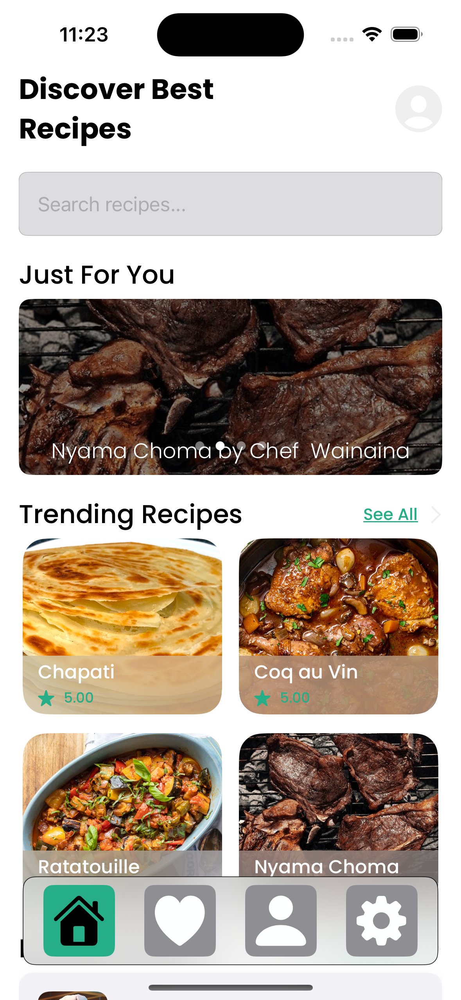
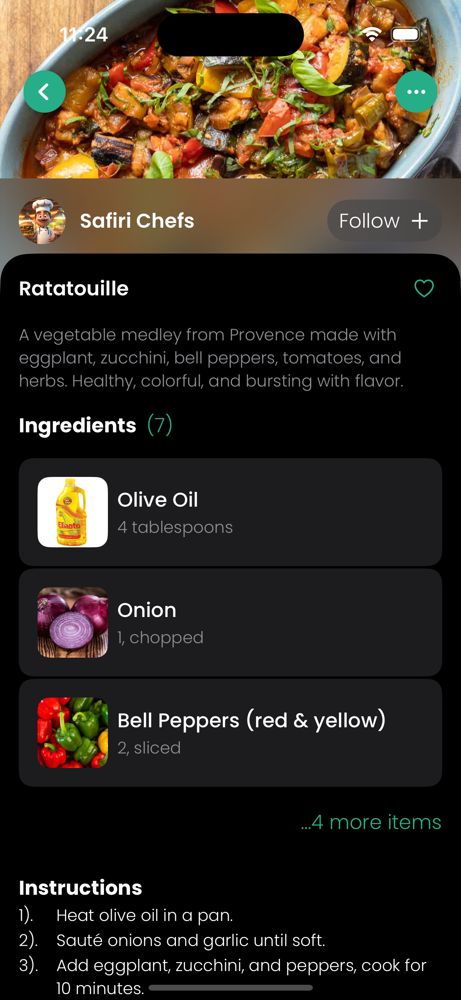
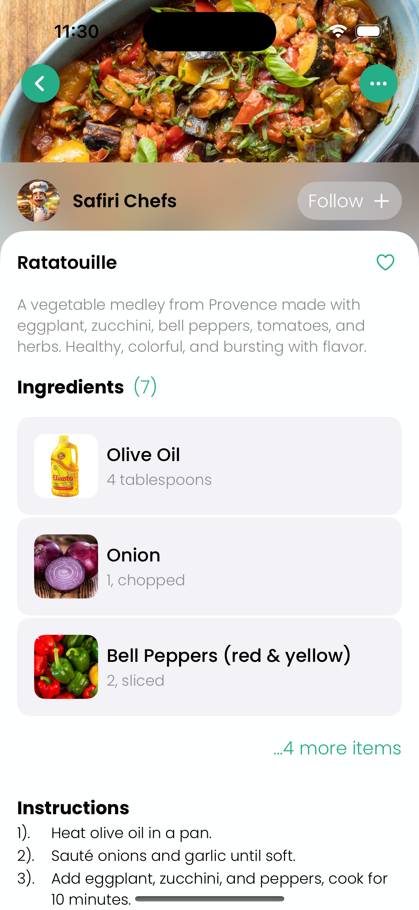
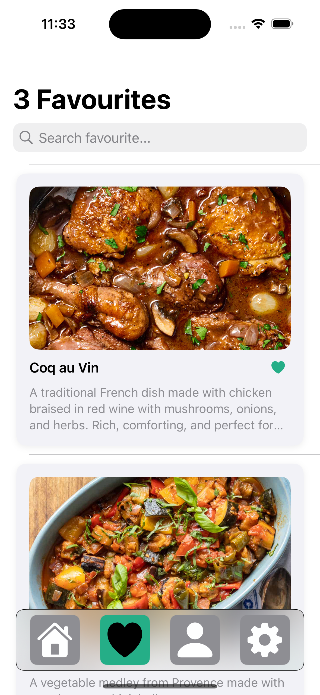
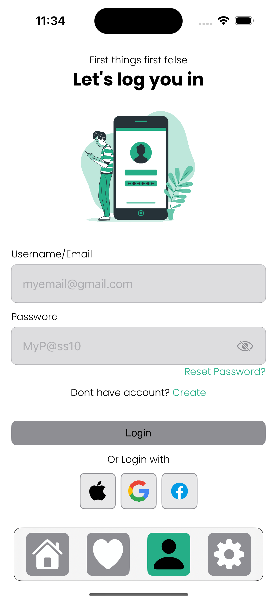
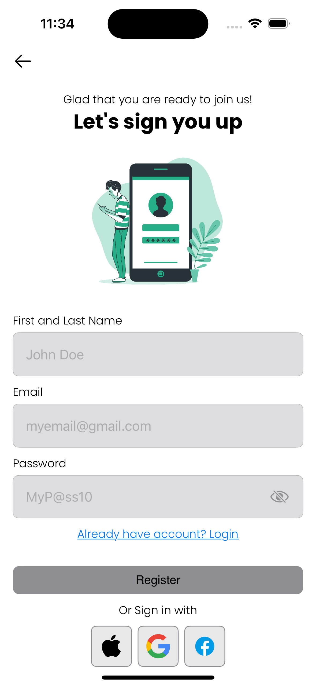
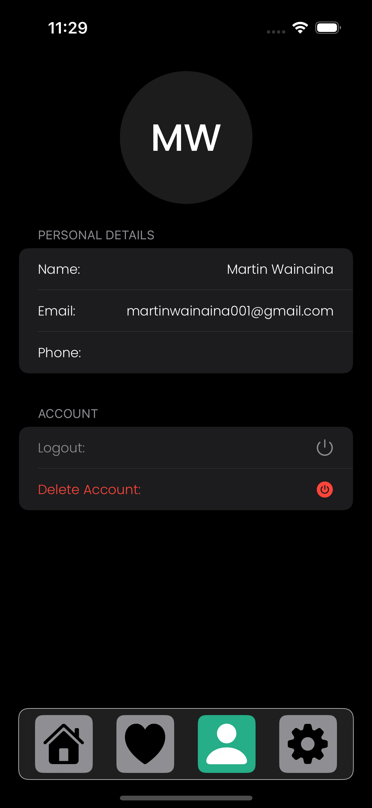
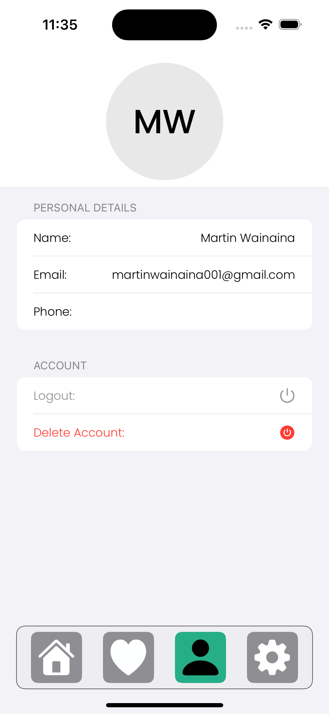
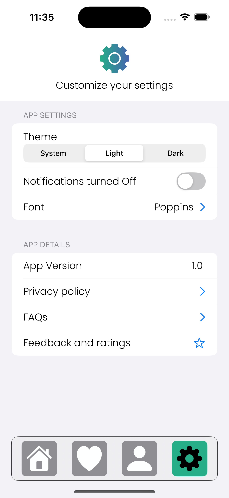

# Recipe App

A beautifully designed mobile app to explore delicious recipes, discover top chefs, and manage your favorite dishes. This app supports both Dark and Light modes for an elegant user experience.

---

## Screenshots – Dark & Light Mode

| Dark Mode                    | Light Mode                      |
|-----------------------------|----------------------------------|
|            |            |
|              |              |
|    |    |
|      |      |
|        |        |
|             |             |
|          |          |
|           |           |
|          |          |

---

## Features

### Home Page
- **Just For You**: Personalized recipe recommendations based on preferences.
- **Trending Recipes**: Popular and most-viewed recipes of the week.
- **Popular Chefs**: Showcasing top-rated chefs with their specialties.

### Recipe Details
- **Ingredients**: Cleanly displayed list of all required ingredients.
- **Instructions**: Step-by-step cooking instructions to follow with ease.
- **Chef Info**: Shortcut to view the chef's profile who submitted the recipe.

### Chef Details
- **Chef’s Recipes**: View all recipes submitted by a specific chef.
- **Ratings & Reviews**: See what others think about the chef’s work.

### Favourite Recipes
- **Mark as Favourite**: Save any recipe to your favorites list.
- **Unmark**: Remove from favorites at any time.
- **Share**: Share your favorite recipes with friends and family.

### Authentication
- **Login**: Sign in with your email and password.
- **Register**: Create a new account with personal information.

### Profile
- **User Info**: View and edit your name, email, and other personal details.

### Settings
- **Theme Settings**: Toggle between Light and Dark mode.
- **Notification Preferences**: Turn on/off push notifications for updates.

---

## Tech Stack

- **Frontend**: SwiftUI / Jetpack Compose (depending on platform)
- **Backend**: Firebase / REST API (Laravel REST Framework)
- **State Management**: MVVM Architecture
- **Other Tools**: 
  - Firebase Auth & Firestore (for user and data management)
  - Responsive design for Dark and Light themes

---

## 📂 Folder Structure (Sample)
screens/
│
├── Home/
├── RecipeDetails/
├── ChefDetails/
├── Favourites/
├── Auth/
├── Profile/
└── Settings/
